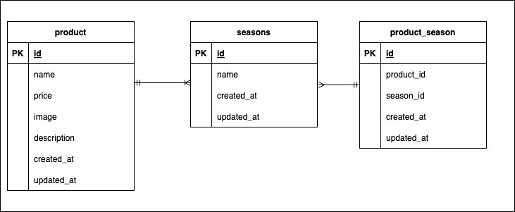

# 確認テスト2 もぎたて

## 環境構築
### Dockerビルド
1. リポジトリをクローンします
```
git clone git@github.com:mattyaaa/mogitate.git
```

2. DockerDesktopアプリを立ち上げます。
```
docker-compose up -d --build
```

> *MacのM1・M2チップのPCの場合、`no matching manifest for linux/arm64/v8 in the manifest list entries`のメッセージが表示されビルドができないことがあります。
エラーが発生する場合は、docker-compose.ymlファイルの「mysql」内に「platform」の項目を追加で記載してください*
``` bash
mysql:
    platform: linux/x86_64(この文追加)
    image: mysql:8.0.26
    environment:
```

### Laravel環境構築
1. PHPコンテナに入ります。
```
docker-compose exec php bash
```

2. Composerをインストールします。
```
composer install
```

3. 「.env.example」ファイルを 「.env」ファイルに命名を変更します。
```
cp .env.example .env
```

4. .envに以下の環境変数を追加
``` text
DB_CONNECTION=mysql
DB_HOST=mysql
DB_PORT=3306
DB_DATABASE=laravel_db
DB_USERNAME=laravel_user
DB_PASSWORD=laravel_pass
```
5. アプリケーションキーを生成します。
``` bash
php artisan key:generate
```

6. データベースのマイグレーションを実行します。
``` bash
php artisan migrate
```

7. データベースのシーディングを実行します。
``` bash
php artisan db:seed
```

## 使用技術(実行環境)
- PHP:8.3.13
- Laravel:8.75
- MySQL:8.0.26

## ER図
以下にER図を示します。ER図はデータベースの設計図のようなものです。



## URL
- 開発環境：http://localhost/
- phpMyAdmin:：http://localhost:8080/